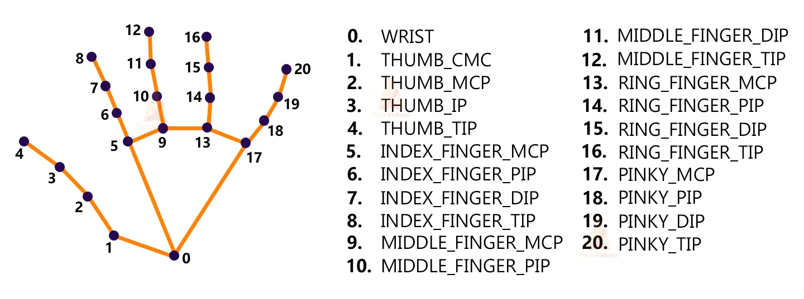

# Hand_Gesture_Detection_OpenCV

This project demonstrates how to use Python and various libraries to recognize hand gestures using a webcam. The recognized gestures can be used in various applications, such as controlling a user interface or playing games.

<div style="text-align: center;">
  
  <figcaption>These key points will be fed into a pre-trained gesture recognizer network to recognize the hand pose.</figcaption>
</div>

## Prerequisites

Make sure you have the following software installed:

1. **Python** – 3.x (We used Python 3.8.8 in this project)

2. **OpenCV** – 4.5  
   ```bash
   pip install opencv-python
3. **MediaPipe** – 0.8.5
   ```bash
   pip install mediapipe
4. **TensorFlow** – 2.5.0
   ```bash
   pip install tensorflow
5. **NumPy** – 1.19.3
   ```bash
   pip install numpy

## Steps to Solve the Project

1. **Import Necessary Packages**
   ```python
   import cv2
   import mediapipe as mp
   import tensorflow as tf
   import numpy as np


2. **Initialize Models**
   Initialize the necessary models, including MediaPipe and TensorFlow models.

3. **Read Frames from a Webcam**
   Capture video from the webcam using OpenCV:
   ```python
   cap = cv2.VideoCapture(0)

4. **Detect Hand Keypoints**
   Use MediaPipe to detect hand keypoints in each frame captured from the webcam.

6. **Recognize Hand Gestures**
   The detected key points will be fed into a pre-trained gesture recognizer network to recognize the hand pose.
